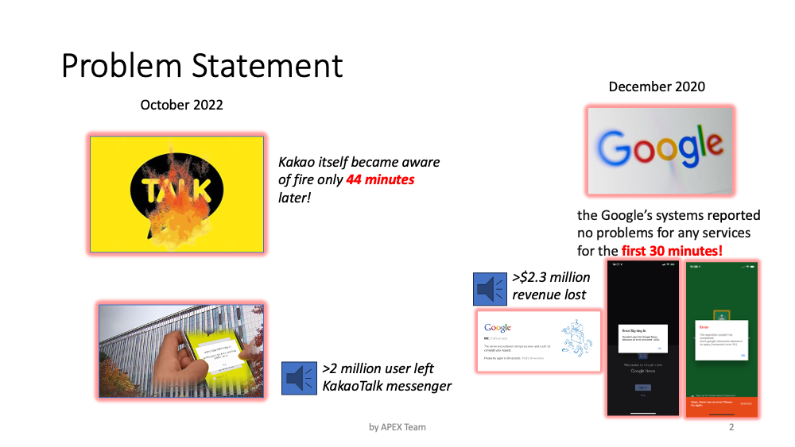
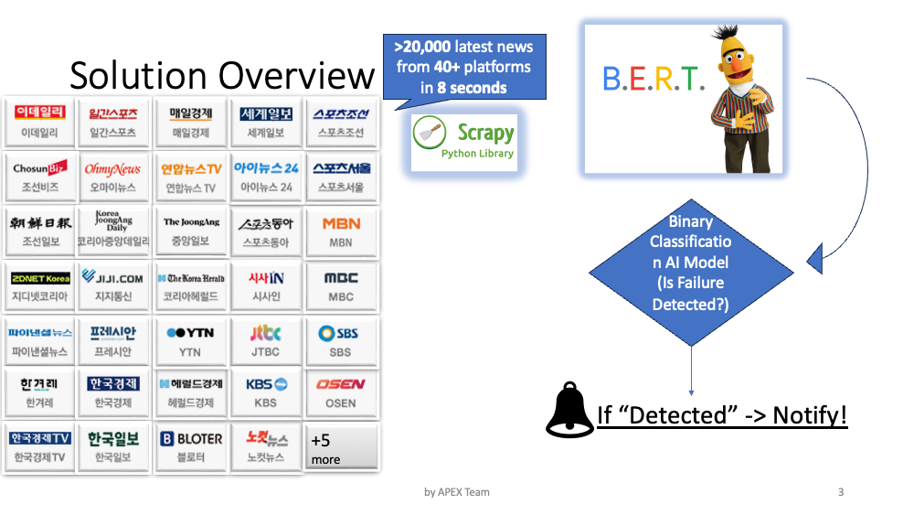
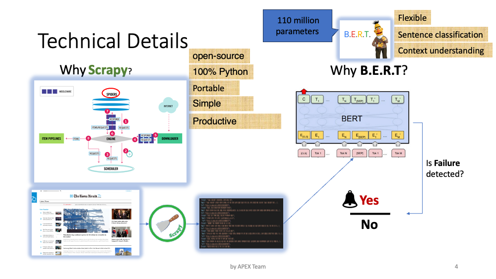
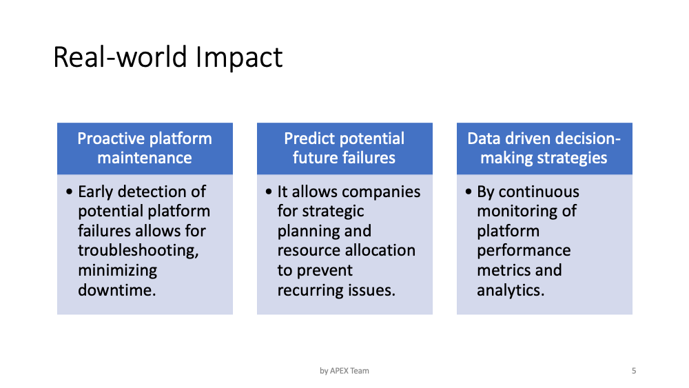

# Failure Detection System Readme

## Overview

The Failure Detection System is a robust and reliable solution designed to identify and alert users about potential failures in a system. This README provides essential information to help you understand, install, and configure the Failure Detection System.

## Introduction

The Failure Detection System is a proactive tool that continuously monitors various aspects of a system to detect any potential failures or anomalies. By utilizing advanced algorithms and sensors, it provides timely alerts, allowing users to address issues before they escalate.

## Features

- **Real-time Monitoring:** Continuous monitoring of critical system parameters.
- **Alerting Mechanism:** Instant notifications via email, SMS, or other configurable channels.
- **Customizable Thresholds:** Set threshold values for different parameters to tailor the system to your needs.
- **Historical Data:** Maintain a record of historical data for analysis and trend identification.

## Installation

To install the Failure Detection System, follow these steps:

```bash
git clone https://github.com/AbdirayimovS/FAILURE_DETECTION_SYSTEM.git
cd FAILURE_DETECTION_SYSTEM
pip install -r requirements.txt
streamlit run embedding_main.py
```
## Presentation






## Demo
[](https://github.com/AbdirayimovS/FAILURE_DETECTION_SYSTEM/blob/master/Demo_2.mp4)https://github.com/AbdirayimovS/FAILURE_DETECTION_SYSTEM/blob/master/Demo_2.mp4
